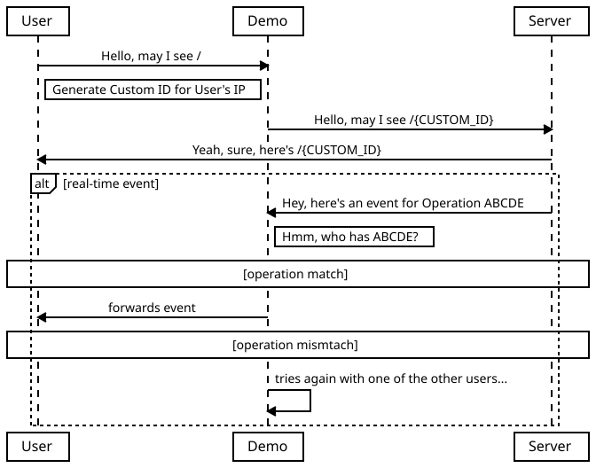

# ft-demo
ft-demo is a wrapper around [`ft`](https://github.com/lemondevxyz/ft) that enables random users to try ft. checkout the graph below to understand how `ft-demo` works.

## sweet, can I try?
yeah, just go to [`ft-demo url`](https://ft.lemondev.xyz). 

Do note: this instance will restart everyday at 00:00 MYT Time. 